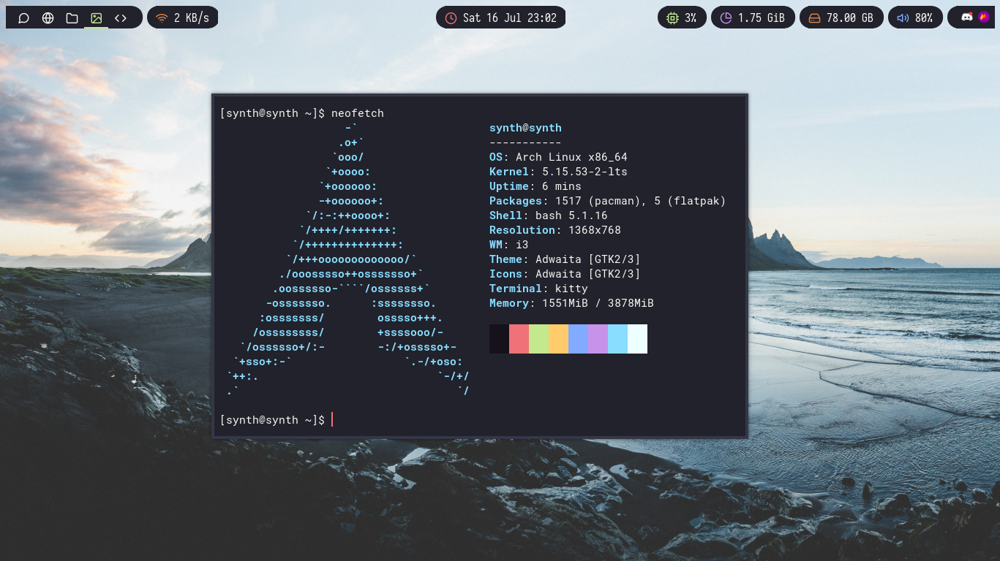

# dotfiles
My Arch Linux dotfiles - most of them are downloaded from other people.

Make sure to edit the i3 config to your liking, this includes removing auto-start items and changing hotkeys.

The unsplash.sh goes into your home directory (do not question me.) and gives you a randomized wallpaper, you can optionally turn on so it also changes your terminal color based on the wallpaper by uncommenting the `wal -i` command.

*I use arch btw*

# Requirements
* i3wm
* i3-gaps
* polybar
* rofi
* dunst
* kitty
* betterlockscreen
* picom
* flameshot (OPTIONAL)
* mpd
* feh

# Preview

